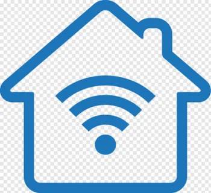

# Smart Home IoT Simulation

A desktop application that simulates a smart home environment with interconnected IoT devices, automation rules, and a real-time GUI dashboard. Built with Python and Tkinter.


## Overview

This application simulates three common smart home devices — a smart light, thermostat, and security camera — running in real-time with automation rules that govern their interactions. A background thread continuously simulates device behavior while the Tkinter GUI provides live status updates and manual controls.

### Key Features

- **Smart Light** — Toggle on/off with adjustable brightness (0–100%)
- **Thermostat** — Toggle on/off with temperature control (15–30°C)
- **Security Camera** — Motion detection, infrared mode, and recording status
- **Automation Rules** — Devices react to each other's state automatically
- **Real-time Simulation** — Background thread updates device states every 3 seconds
- **Live Dashboard** — Tkinter GUI with sliders, buttons, and status display

### Automation Rules

| Trigger | Action |
|---------|--------|
| Light is off | Camera infrared turns on |
| Light is on | Camera infrared turns off |
| Motion detected | Light turns on automatically |
| Camera is on | Recording may toggle randomly |
| Camera is off | Recording stops |

## Screenshot



## Project Structure

```
iot-home-simulation/
├── main.py                 # Entry point — starts simulation thread and GUI
├── iothings.py             # IoT device classes (SmartLight, Thermostat, SecurityCamera)
├── automation_system.py    # Automation rules and device behavior simulation
├── iothings_gui.py         # Tkinter GUI dashboard
└── smart_home.png          # Application icon / screenshot
```

### Architecture

| Module | Responsibility |
|--------|---------------|
| `iothings.py` | Base `IoTDevice` ABC and concrete device classes with state management |
| `automation_system.py` | Device registry, automation rule engine, and random behavior simulation |
| `iothings_gui.py` | Tkinter-based dashboard with controls, status display, and device interaction |
| `main.py` | Application bootstrap — initializes devices, starts simulation thread, launches GUI |

## Getting Started

### Prerequisites

- Python 3.7+
- Tkinter (included with most Python installations)

> **Note:** On some Linux distributions, Tkinter needs to be installed separately:
> ```bash
> # Ubuntu/Debian
> sudo apt install python3-tk
>
> # Fedora
> sudo dnf install python3-tkinter
> ```

### Running the Application

```bash
git clone https://github.com/Jamolov-Isroilbek/iot-home-simulation.git
cd iot-home-simulation
python3 main.py
```

The dashboard window will open and the simulation starts automatically. Device states update every 3 seconds, or you can interact manually using the controls.

## Usage

- **Toggle ON/OFF** — Turn any device on or off manually
- **Brightness Slider** — Adjust light brightness (setting to 0 turns the light off)
- **Temperature Slider** — Set thermostat between 15°C and 30°C
- **Random Detect Motion** — Simulate a motion detection event on the camera
- **Status List** — Top panel shows current state of all devices in real time

## Tech Stack

| Category | Technologies |
|----------|-------------|
| Language | Python 3.7+ |
| GUI | Tkinter |
| Concurrency | `threading` module |
| Design Pattern | ABC (Abstract Base Class) for device hierarchy |

## License

This project is licensed under the MIT License - see the [LICENSE](LICENSE) file for details.

## Author

**Isroilbek Jamolov** — [GitHub](https://github.com/Jamolov-Isroilbek)

---

<p align="center">
  <i>Built as a university IoT programming project at ELTE</i>
</p>
